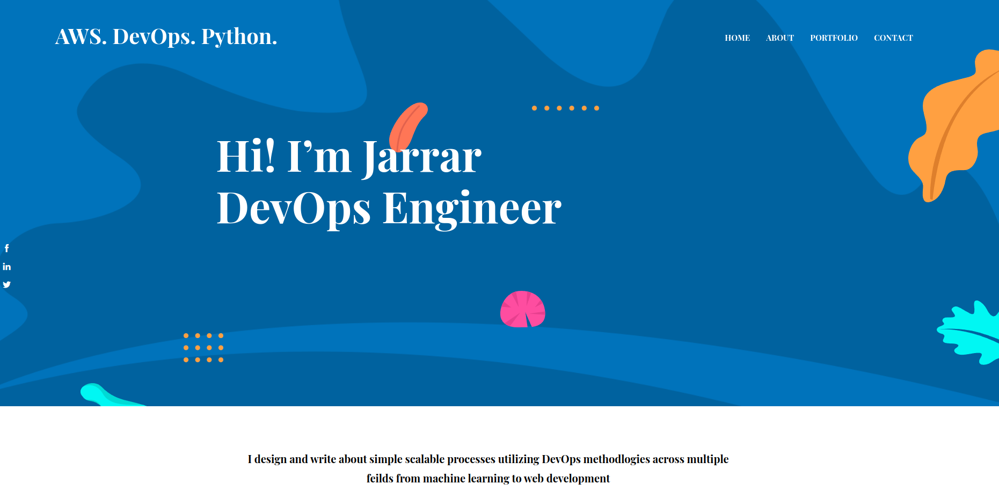
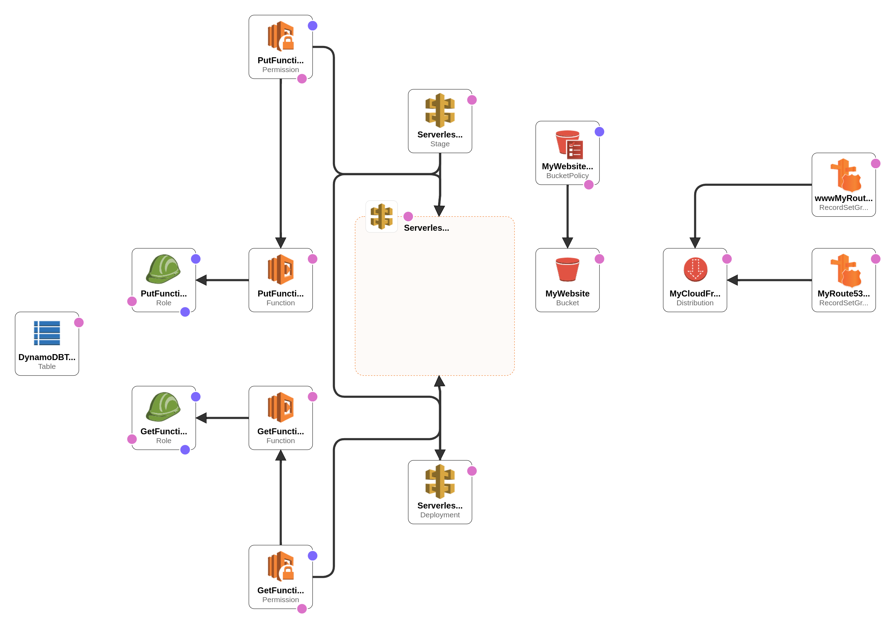

# Cloud-Resume-Challenge-SAM

## This repo is based on the cloud resume challenge by Forrest Brazeal from Google

https://cloudresumechallenge.dev/docs/the-challenge/aws/

Helpful video series by Open up to the cloud

- https://youtu.be/e7vZe7qZFmE
- https://github.com/openupthecloud/cloud-resume-challenge/tree/setup-ci-cd-infra

## Frontend - www.jarraroptimized.com

- implemented using HUGO
- https://github.com/progami/Hugo-Static-Website-JarrarOptimized

## Infrastructure (Backend)

- HTML, CSS, JS (Frontend)
- Python (Backend)
- AWS Console, AWS CLI, AWS SDK/Boto3 (Backend) 
- Route 53 (DNS)
- Cloudfront (CDN)
- ACM (SSL/HTTPS)
- DynamoDB (Database tier)
- API Gateway / Lambda / AWS SAM (Backend)
- Cloudformation (IaC)
- GitHub Actions (CI/CD)
- GitHub (Source Control)
- Makefiles (Easier builds)

*This project relies heavily on AWS-SAM for most implementations, i suggest you go and look it up seperately*
